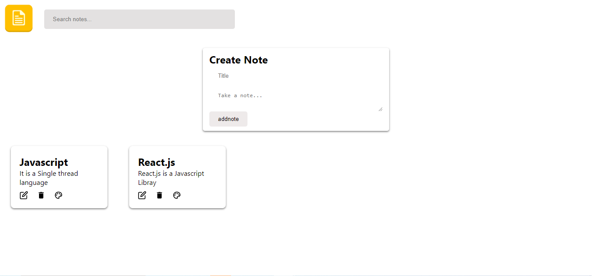
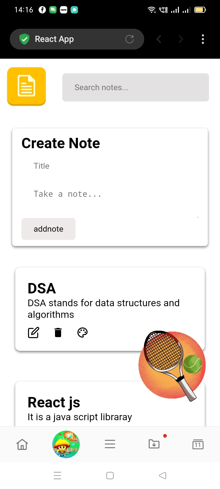

# Google Keep Clone Project

## Project Description

This project is a simplified version of Google Keep, a note-taking application, built using React. The application allows users to create, edit, and delete notes, organize them with color coding, and features a responsive design.

## Table of Contents

1. [Features](#features)
2. [Tech Stack](#tech-stack)
3. [Project Structure](#project-structure)
4. [Instructions for Running Locally](#instructions-for-running-locally)
5. [Deployment (Optional)](#deployment-optional)
6. [Evaluation Criteria](#evaluation-criteria)

## Features

- **Note Listing:** Display a list of notes with titles and content.
- **Create Note:** Add new notes, which appear at the top of the list.
- **Edit Note:** Modify note titles and content with real-time updates.
- **Delete Note:** Remove notes with user confirmation.
- **Responsive Design:** Ensures a seamless experience on various devices.
- **Color Coding:** Assign different colors to notes for organization.
- **Local Storage:** Persist notes even after page refresh.
- **Bonus Feature (Optional):** Search functionality for filtering notes.

## Tech Stack

- React
- CSS (styled-components for styling)
- Local Storage

## Project Structure
src/
components/
- Note.jsx
- NoteList.jsx
- CreateNote.jsx
- Header.jsx
- ColorPicker.jsx
- Search.jsx 
context/
- NoteContext.js
- NoteProvider.js
customHook/
- useNoteContext.js


App.js
index.js
## Desktop View Of Application

## Mobile View 

## Instructions for Running Locally

1. **Clone the repository:**

    ```bash
    git clone https://github.com/your-username/google-keep-clone.git
    cd google-keep-clone
    ```

2. **Install dependencies:**

    ```bash
    npm install
    ```

3. **Run the application:**

    ```bash
    npm start
    ```

4. **Open the application in your browser at [http://localhost:3000](http://localhost:3000).**

## Deployment (Optional)

